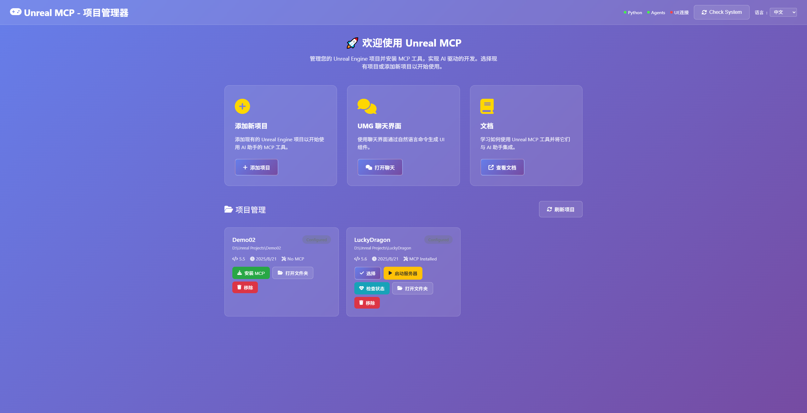

# Unreal MCP - AI 驱动的虚幻引擎开发工具

<div align="center">



[](https://opensource.org/licenses/MIT)
[](https://www.unrealengine.com)
[](https://www.python.org)
[](https://github.com/chongdashu/unreal-mcp)

</div>

en [English](README.en.md) 英文版内容更丰富和详细

## 🎯 项目简介

Unreal MCP 是一个革命性的工具，让 AI 助手（如 Cursor、Claude Desktop、Windsurf）能够通过自然语言直接控制虚幻引擎。通过 Model Context Protocol (MCP)，您可以：

- 🎮 **自然语言控制**：用中文描述需求，AI 自动生成蓝图、UI、数据表等
- 🚀 **一键安装**：简单的批处理脚本，快速集成到任何 UE 项目
- 🌐 **Web 管理界面**：可视化项目管理，支持多项目切换
- 🤖 **7 大工具集**：覆盖蓝图、UI、编辑器、数据表等核心功能

## ⚡ 快速开始

### 方式一：一键安装（推荐）
```bash
# Windows 用户直接双击运行
ONE_CLICK_INSTALL.bat
```

### 方式二：Web 界面管理
```bash
# 启动 Web 管理界面
START_WEB_INTERFACE.bat
# 浏览器访问 http://localhost:5000
```

### 方式三：手动安装
1. 复制 `MCPGameProject/Plugins/UnrealMCP` 到您的项目
2. 在 UE 编辑器中启用 UnrealMCP 插件
3. 运行 `python install_to_project.py "您的项目路径"`

## 🛠️ 核心功能

| 工具类别 | 主要功能 | 使用场景 |
|---------|---------|---------|
| **[蓝图工具](Docs/Blueprint-Tools-Usage.md)** | 创建蓝图类、添加组件、设置属性 | 游戏逻辑开发、Actor 创建 |
| **[蓝图节点工具](Docs/Blueprint-Node-Tools-Usage.md)** | 创建事件节点、连接节点、查找节点 | 蓝图可视化编程 |
| **[蓝图动作工具](Docs/Blueprint-Action-Tools-Usage.md)** | 动态发现可用动作、智能节点创建 | 高级蓝图开发 |
| **[UMG UI 工具](Docs/UMG-Tools-Usage.md)** | 创建 UI 组件、布局设计、事件绑定 | 用户界面开发 |
| **[编辑器工具](Docs/Editor-Tools-Usage.md)** | 场景管理、Actor 操作、视口控制 | 场景编辑、关卡设计 |
| **[数据表工具](Docs/DataTable-Tools-Usage.md)** | 创建数据表、管理行数据、属性映射 | 游戏数据管理 |
| **[项目管理工具](Docs/Project-Tools-Usage.md)** | 文件夹管理、输入映射、结构体创建 | 项目组织、系统配置 |

## 🎮 使用示例

### 创建游戏角色
```
"创建一个名为 PlayerCharacter 的 Pawn 蓝图，添加摄像机组件和静态网格体组件"
```

### 设计 UI 界面
```
"创建一个主菜单 UI，包含开始游戏按钮、设置按钮和退出按钮"
```

### 管理游戏数据
```
"创建一个物品数据表，包含武器、防具和消耗品的数据"
```

## 📋 系统要求

- **虚幻引擎**: 5.6+
- **Python**: 3.12+
- **AI 客户端**: Cursor、Claude Desktop、Windsurf 等支持 MCP 的客户端

## 🔧 配置 AI 客户端

### Cursor 配置
在项目根目录创建 `.cursor/mcp.json`：
```json
{
  "mcpServers": {
    "blueprintMCP": {
      "command": "python",
      "args": ["Python/blueprint_mcp_server.py"]
    }
  }
}
```

### Claude Desktop 配置
在 `~/.config/claude-desktop/mcp.json` 中添加相同配置。

## 📚 详细文档

- **[AI 集成指南](Docs/AI_INTEGRATION_GUIDE_ZH.md)** - 了解 MCP 架构和 AI 助手配置
- **[简单集成指南](SIMPLE_INTEGRATION_GUIDE.md)** - 快速上手教程
- **[功能特性](Docs/FEATURES_ZH.md)** - 完整功能列表
- **[使用指南](Docs/USAGE_GUIDE_ZH.md)** - 详细使用说明

### 工具使用文档
- [蓝图工具使用指南](Docs/Blueprint-Tools-Usage.md)
- [蓝图节点工具使用指南](Docs/Blueprint-Node-Tools-Usage.md)
- [蓝图动作工具使用指南](Docs/Blueprint-Action-Tools-Usage.md)
- [UMG UI 工具使用指南](Docs/UMG-Tools-Usage.md)
- [编辑器工具使用指南](Docs/Editor-Tools-Usage.md)
- [数据表工具使用指南](Docs/DataTable-Tools-Usage.md)
- [项目管理工具使用指南](Docs/Project-Tools-Usage.md)

## 🚨 注意事项

- 本项目处于**实验性**阶段，API 可能发生变化
- 建议在测试环境中使用，生产环境请谨慎
- 使用前请备份重要项目文件

## 🤝 贡献

欢迎提交 Issue 和 Pull Request！请查看 [贡献指南](CONTRIBUTING.md)。

## 📄 许可证

MIT License - 详见 [LICENSE](LICENSE) 文件。

---

<div align="center">

**让 AI 成为您的虚幻引擎开发伙伴！** 🚀

</div>
